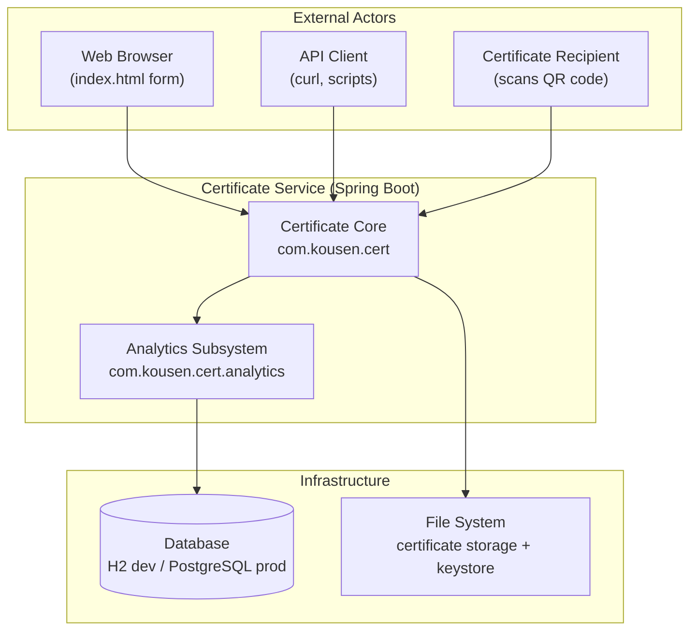
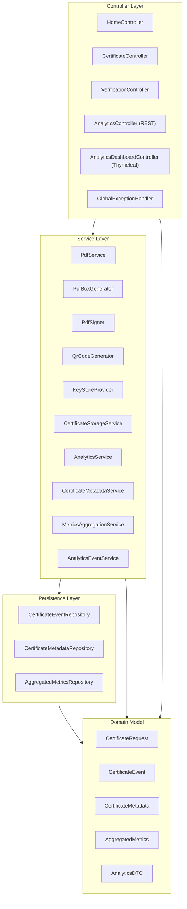
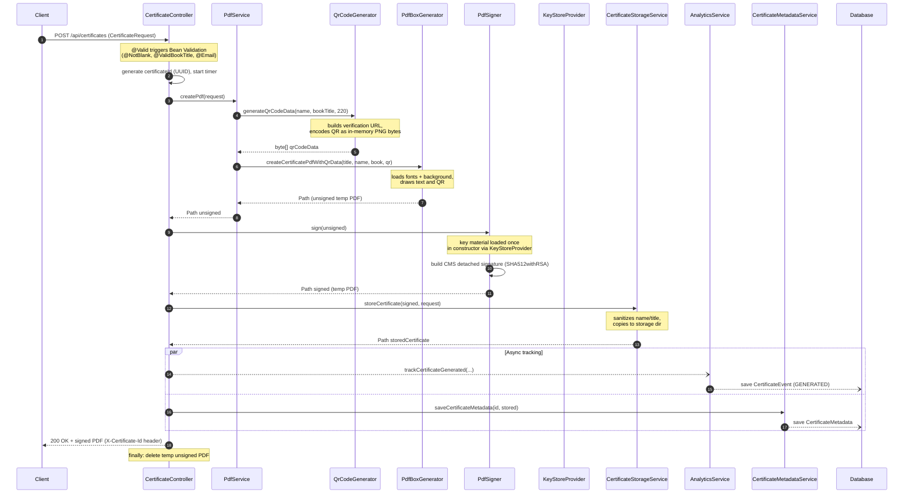
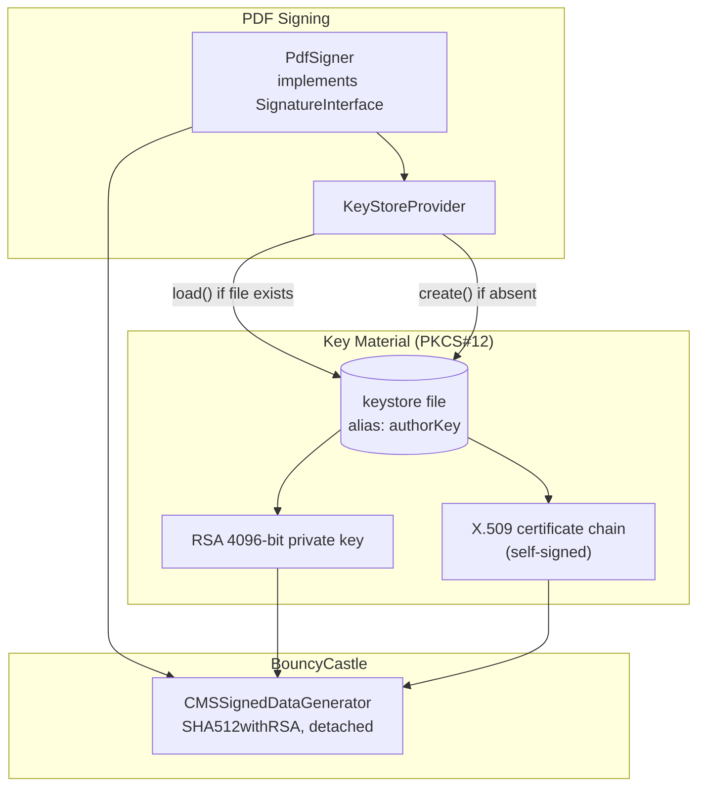
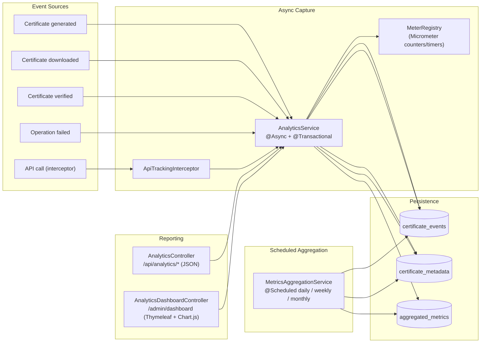
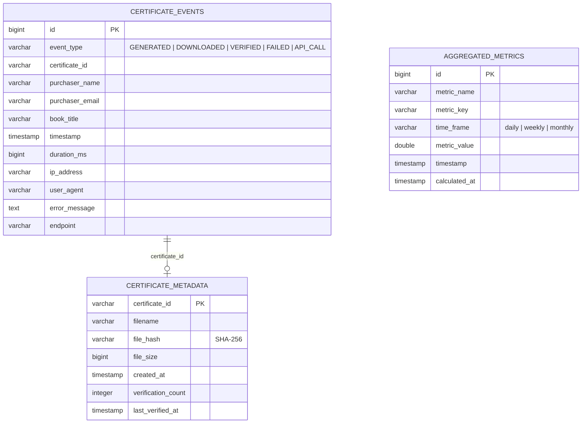

# Certificate Service — Architecture

This document describes the internal structure of the Certificate Service: a Spring Boot
application that generates personalized, digitally-signed PDF certificates of book
ownership with QR-code verification, plus an analytics subsystem that tracks usage.

It complements the diagrams in `README.md` with code-grounded detail derived from the
actual classes under `src/main/java/com/kousen/cert`.

---

## 1. System Context

The application is a single deployable JAR (`app.jar`). It has two logical halves that
share a process and a database but are otherwise loosely coupled: the **certificate core**
(synchronous request/response PDF pipeline) and the **analytics subsystem** (asynchronous
event capture plus a reporting dashboard).

---

## 2. Layered View

| Layer | Responsibility | Key types |
|-------|----------------|-----------|
| Controller | HTTP binding, validation entry point, response shaping | `CertificateController`, `VerificationController`, `AnalyticsController`, `AnalyticsDashboardController`, `HomeController`, `GlobalExceptionHandler` |
| Service | Business logic; PDF pipeline, signing, storage, analytics | `PdfService`, `PdfBoxGenerator`, `PdfSigner`, `QrCodeGenerator`, `KeyStoreProvider`, `CertificateStorageService`, `AnalyticsService`, `MetricsAggregationService`, `CertificateMetadataService` |
| Persistence | Spring Data JPA repositories | `CertificateEventRepository`, `CertificateMetadataRepository`, `AggregatedMetricsRepository` |
| Model | Records and JPA entities | `CertificateRequest` (record), `CertificateEvent`, `CertificateMetadata`, `AggregatedMetrics`, `AnalyticsDTO` |

---

## 3. Certificate Generation Pipeline

The core use case. A `POST /api/certificates` request flows through validation, PDF
rendering, cryptographic signing, storage, and (asynchronously) analytics.

### Notes on the pipeline

- **`certificateId`** is a `UUID` minted in the controller. It is returned in the
  `X-Certificate-Id` response header and links a `CertificateEvent` to its
  `CertificateMetadata`.
- **Temp file hygiene** — `PdfService` and `PdfSigner` write to `Files.createTempFile(...)`.
  The controller deletes the unsigned temp PDF in a `finally` block; the signed file is
  what gets streamed back and copied into storage.
- **Error path** — any exception is caught, recorded via
  `AnalyticsService.trackCertificateError(...)`, and rethrown so
  `GlobalExceptionHandler` can produce the HTTP error response.
- **`PdfSigner` is not a Spring bean.** `CertificateController` constructs it directly
  in its constructor from the `certificate.keystore` property, wrapping a
  `KeyStoreProvider`. See [§7](#7-design-observations).

---

## 4. Digital Signing Subsystem

- **`KeyStoreProvider`** lazily provisions a PKCS#12 keystore at the configured path.
  If the file is missing it generates a 4096-bit RSA key pair and a self-signed X.509v3
  certificate (10-year validity, `digitalSignature + nonRepudiation` key usage) and
  writes the keystore to disk. If the file exists it is simply loaded.
- **Password resolution** (in both `KeyStoreProvider` and `PdfSigner`) checks the
  `CERT_PWD` environment variable, then the `CERT_PWD` system property, then defaults to
  `changeit`.
- **`PdfSigner`** implements PDFBox's `SignatureInterface`. It reads key material once in
  its constructor, then on each `sign(Path)` call adds a `PDSignature` dictionary to the
  document and produces a detached CMS (PKCS#7) signature with BouncyCastle, saved
  incrementally so the original byte ranges are preserved.
- Because the certificate is **self-signed**, PDF readers show trust warnings — this is
  expected and explained on the verification page.

---

## 5. Analytics Subsystem

The analytics half captures events without slowing down the certificate pipeline, then
aggregates and serves them for reporting.

- **`AnalyticsService`** is `@Async` and `@Transactional`. Each `track*` method returns a
  `CompletableFuture<Void>` and runs on a separate thread, so analytics never block (or
  fail) the certificate response. Internal failures are caught and logged, not rethrown.
- It also feeds **Micrometer** (`MeterRegistry`) counters and timers
  (`certificates.generated`, `api.response.time`, etc.), exposed via Spring Boot Actuator.
- **`ApiTrackingInterceptor`** captures generic API-call events; it has a variant
  (`trackApiUsageWithExtractedData`) that pre-extracts request data to avoid touching a
  recycled `HttpServletRequest` from the async thread.
- **`MetricsAggregationService`** runs on cron schedules (daily 1 AM, weekly Mon 2 AM,
  monthly 1st 3 AM) to roll raw events up into `aggregated_metrics`.
- **`getDashboardData()`** assembles an `AnalyticsDTO.DashboardData` aggregate (summary,
  daily trend, book popularity, recent activity, performance, system metrics) consumed by
  both the HTML dashboard and the REST API.

---

## 6. Data Model

`CertificateRequest` is **not** persisted — it is an inbound record with Bean Validation
constraints (`@NotBlank`, custom `@ValidBookTitle`, optional `@Email`) and a hard-coded
`ALLOWED_BOOK_TITLES` whitelist.

### Database portability

The same SQL must run on H2 (dev) and PostgreSQL (prod). Per the project conventions:

- Use `CAST(timestamp AS DATE)` rather than database-specific functions like `DATE()`.
- `@Query` `ORDER BY` clauses reference entity attributes, not SELECT aliases.
- The active database is selected purely by environment variables (`DATABASE_URL`,
  `DATABASE_DRIVER`, `DATABASE_USERNAME`, `HIBERNATE_DDL_AUTO`, …).

---

## 7. Design Observations

These are characteristics worth knowing when extending the codebase — stated as facts,
not necessarily as problems.

- **`PdfSigner` and `KeyStoreProvider` are plain objects, not Spring beans.**
  `CertificateController` `new`s them up in its constructor. Consequences: signing key
  material is initialized once per controller instance, and these classes are unit-tested
  by direct construction rather than injection.
- **`PdfBoxGenerator` is dual-natured.** `PdfService` has two constructors — one
  `@Autowired` (injected `PdfBoxGenerator`) and one that constructs its own. This keeps it
  testable while still working as a bean.
- **Analytics failures are swallowed by design.** Every `track*` method wraps its body in
  try/catch and only logs on error. This protects the user-facing path but means missing
  analytics data will be silent.
- **`QrCodeGenerator` has two code paths** — `generateQrCode` (writes a temp PNG file) and
  `generateQrCodeData` (returns PNG bytes). The live pipeline uses the in-memory byte
  variant; the file variant remains for other callers/tests.
- **`QrCodeGenerator.encodeUrlParam`** does manual character replacement rather than
  `URLEncoder`. Adequate for the current verification URL, but a narrower encoder than
  the standard library's.
- **Coverage gates** (`build.gradle.kts`): 60% overall line coverage, 70% on
  `com.kousen.cert.service.*`. `Application`, `config`, and `model` packages are excluded
  from JaCoCo analysis. However, `jacocoTestCoverageVerification` is **not wired into the
  `check` task**, so the gate is currently decorative and is not enforced by the build
  (`service.*` is presently below the 70% target). The `jacoco` plugin id is also
  declared twice in `build.gradle.kts`.
- **No authentication layer.** Spring Security is not a dependency. The analytics
  dashboard, analytics REST API, and the H2 console (default profile) are all reachable
  without credentials. Anything added to those surfaces is exposed by default.
- **`FontTester` is a scratch class.** It is a dev-only `CommandLineRunner` guarded by
  `@Profile("fonttest")`, used for ad-hoc font diagnostics. It is not part of the request
  path and has no test coverage.
- **`AnalyticsIntegrationTest` requires Docker.** It uses Testcontainers (PostgreSQL), so
  it fails as an environment issue rather than a code defect when Docker is unavailable.

---

## 8. Module Map

| Package | Contents |
|---------|----------|
| `com.kousen.cert` | `Application` (Spring Boot entry point) |
| `com.kousen.cert.controller` | HTTP endpoints + `GlobalExceptionHandler` |
| `com.kousen.cert.service` | PDF pipeline, signing, QR, storage |
| `com.kousen.cert.model` | `CertificateRequest` record + `@ValidBookTitle` validator |
| `com.kousen.cert.config` | `CertificateConfig`, `ServerUrlConfig` |
| `com.kousen.cert.util` | `QrCodeUtil` |
| `com.kousen.cert.analytics.controller` | Dashboard + analytics REST endpoints |
| `com.kousen.cert.analytics.service` | Event tracking, aggregation, metadata |
| `com.kousen.cert.analytics.repository` | Spring Data JPA repositories |
| `com.kousen.cert.analytics.model` | JPA entities + `AnalyticsDTO` |
| `com.kousen.cert.analytics.config` | `WebMvcConfig`, `SchedulingConfig`, `AnalyticsConfig` |
| `com.kousen.cert.analytics.interceptor` | `ApiTrackingInterceptor` |

---

*Generated from source inspection of the `com.kousen.cert` packages. For build/run
instructions and the public API reference, see `README.md`.*
