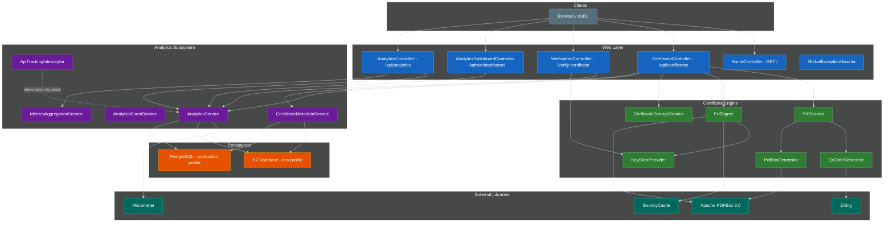
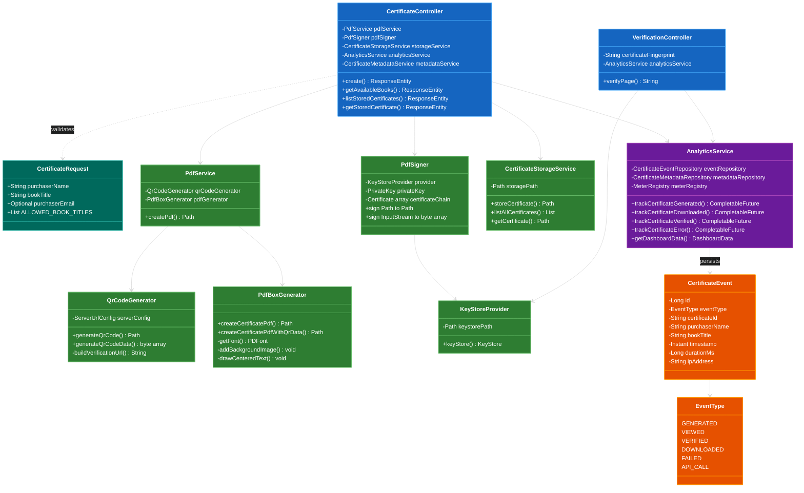
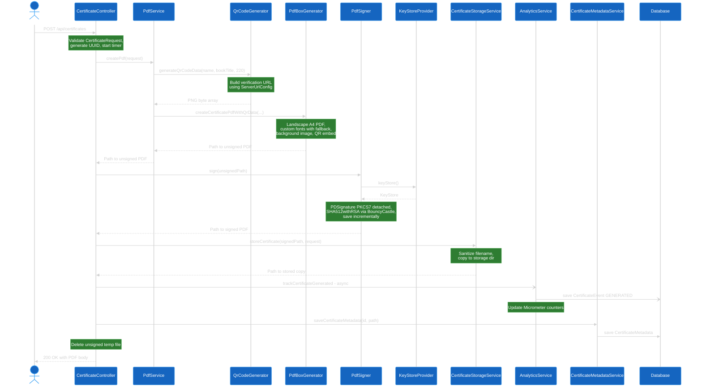
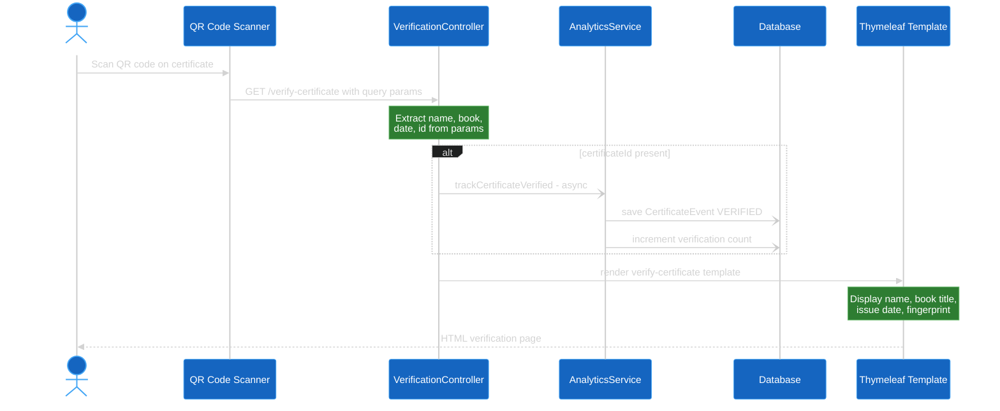
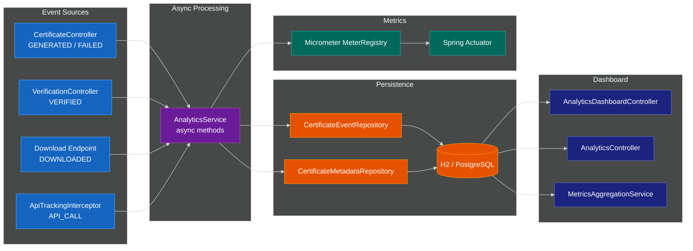
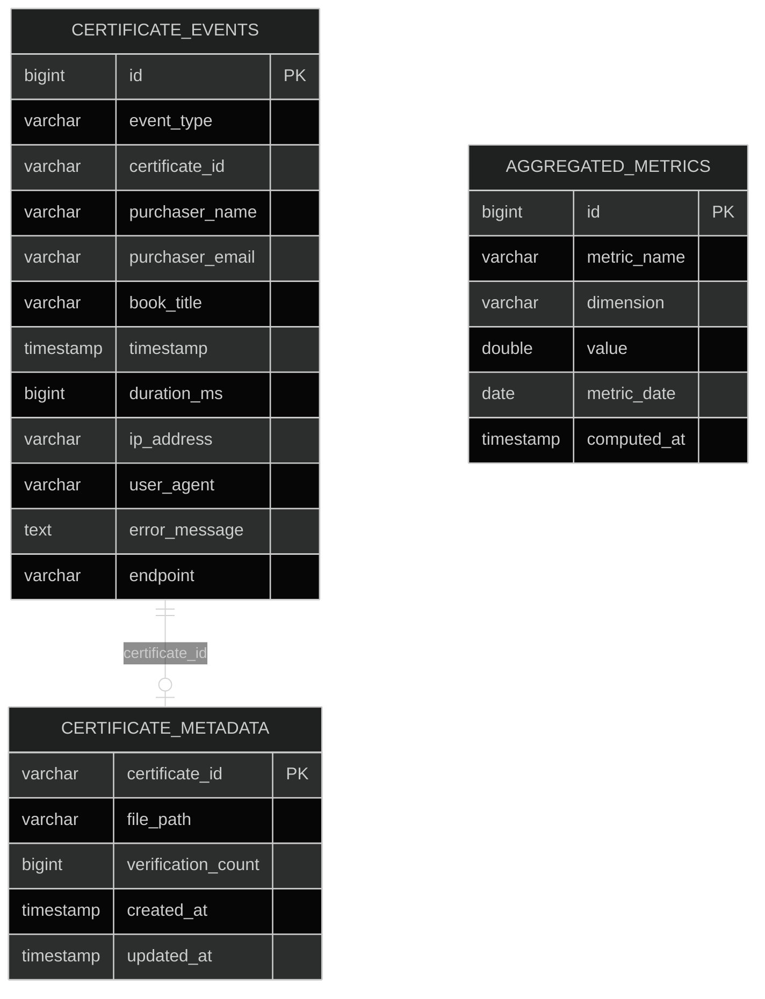

# Certificate Service — Architecture Diagrams

## 1. High-Level Component Overview

This diagram shows the major subsystems and how external actors interact with them.

## 2. Class Dependency Diagram

Shows Spring bean wiring and key relationships between classes.

## 3. Certificate Generation Sequence

The main flow when `POST /api/certificates` is called.

## 4. QR Code Verification Flow

What happens when someone scans the QR code on a certificate.

## 5. Analytics Data Flow

How analytics events flow from request interception through to the dashboard.

## 6. Database Schema

## Color Legend

| Color | Subsystem |
|-------|-----------|
|  Blue | Web / Controller layer |
|  Green | Certificate Engine services |
|  Purple | Analytics subsystem |
|  Orange | Persistence / Entities |
|  Teal | External libraries / Model |
|  Gray | Clients |
|  Indigo | Dashboard views |
