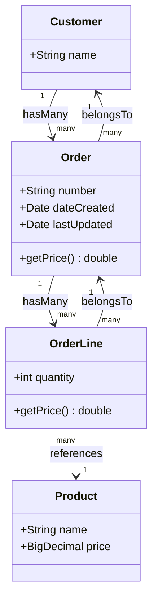
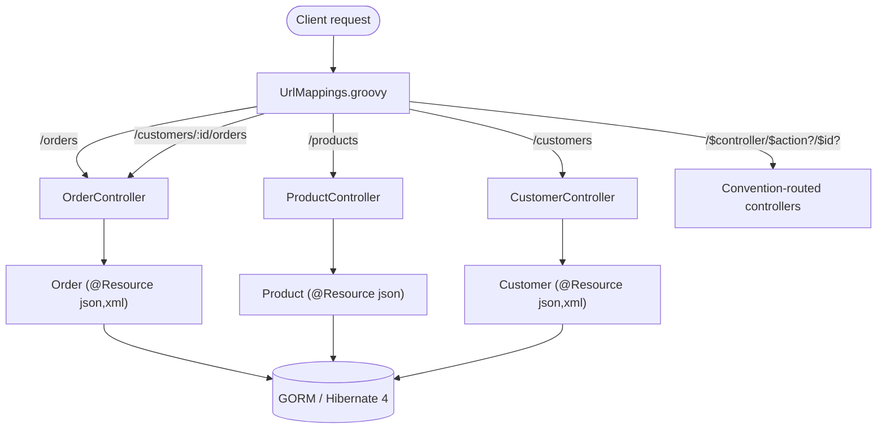

shopping
========

Grails shopping app demonstrated at SpringOne2GX 2014.

Demonstrates:

- static mapping for Order class
- old-style `as JSON` rendering and `render(contentType:'application/json')`
- new `@Resource` annotation with UrlMapping
- nested URL mappings
- HAL support (mostly)
- even has a RESTClient to demo HttpBuilder project

A couple of renderers (specifically, HAL renderers on domain objects rather than collections)
are being flaky, but mostly everything works.

## Domain Model

## REST API Routing

Ken Kousen
ken.kousen@kousenit.com
