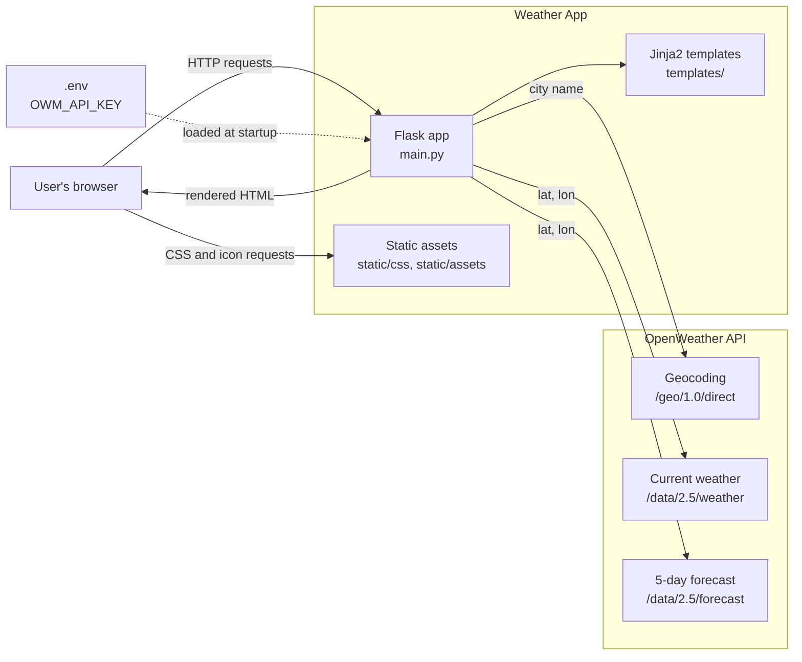
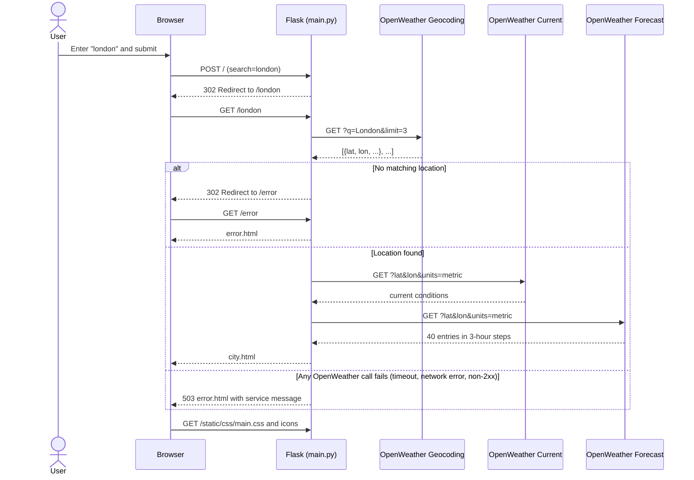
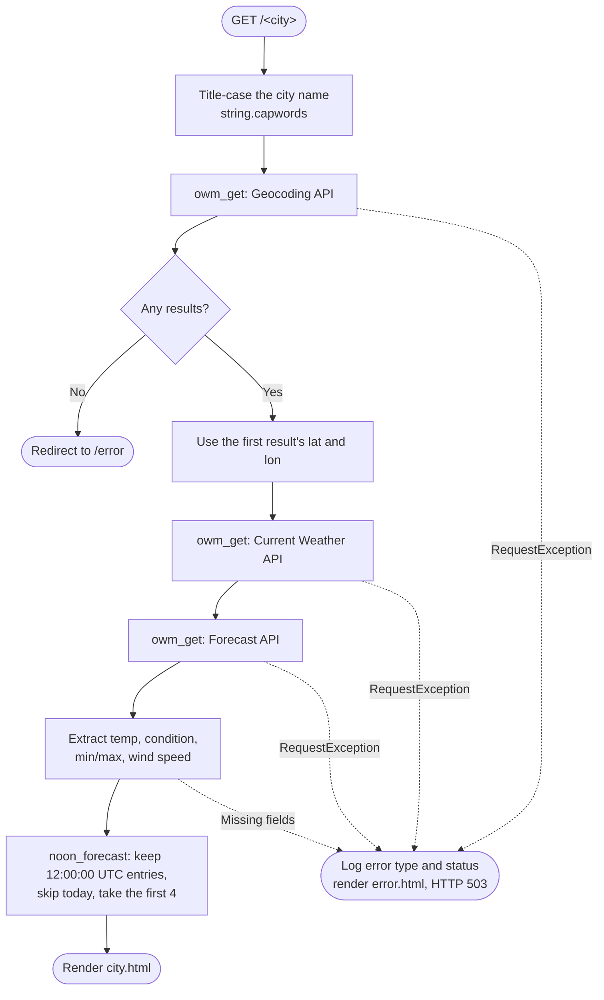
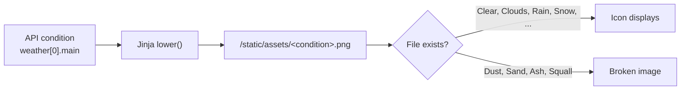

# Architecture

This document describes how the Weather App is structured: its components, how a request flows through them, and the known limitations worth addressing.

## Overview

The Weather App is a small, server-rendered Flask application. It has no database, no client-side JavaScript, and no build step. Every page is rendered on the server with Jinja2, using data fetched live from the [OpenWeather API](https://openweathermap.org/api).

| Layer | Technology | Role |
|---|---|---|
| Web framework | Flask 3.1 | Routing, request handling, redirects |
| Templating | Jinja2 (bundled with Flask) | Server-side HTML rendering |
| HTTP client | requests | Calls to the OpenWeather endpoints |
| Configuration | python-dotenv | Loads `OWM_API_KEY` from `.env` |
| Production server | gunicorn | WSGI server, started by the `Procfile` |
| Styling | Hand-written CSS | Grid, flexbox, and media queries for responsive layout |
| External data | OpenWeather free-tier APIs | Geocoding, current weather, 5-day forecast |

## System context



## Project layout

```
weather-app/
├── main.py              # All application code: config, helpers, routes
├── templates/
│   ├── index.html       # Home page with the city search form
│   ├── city.html        # Current conditions and 4-day forecast
│   └── error.html       # Unknown city, or OpenWeather unavailable
├── static/
│   ├── css/main.css     # All styles, including responsive breakpoints
│   └── assets/          # Background images and weather-condition icons
├── tests/
│   └── test_main.py     # pytest suite; OpenWeather calls are mocked
├── requirements.txt     # Flask, requests, python-dotenv, gunicorn
├── requirements-dev.txt # requirements.txt plus pytest, pytest-cov
├── pytest.ini           # Test paths and pythonpath
├── Procfile             # web: gunicorn main:app
└── .env                 # OWM_API_KEY (not committed)
```

## Routes

| Route | Methods | Handler | Behavior |
|---|---|---|---|
| `/` | GET, POST | `home()` | GET renders the search form. POST reads and strips the `search` field; a blank value redirects back to `/`, otherwise it redirects to `/<city>`. |
| `/<city>` | GET | `get_weather(city)` | Fetches weather data and renders `city.html`. Redirects to `/error` if the city is not found. Renders `error.html` with HTTP 503 if an OpenWeather request fails. |
| `/error` | GET | `error()` | Renders `error.html` with its default "This city does not exist" message. |
| `/favicon.ico` | GET | `favicon()` | Returns an empty 204 response. Without it, browsers requesting the favicon would hit `/<city>` and spend a geocoding call. |

Flask matches static routes like `/error` before variable routes like `/<city>`, so `/error` is never interpreted as a city name.

## Request flow

The home form uses the **POST-Redirect-GET** pattern: the form posts to `/`, which redirects to `/<city>`. Each city page therefore has its own bookmarkable URL, and refreshing it does not resubmit the form.



The three API calls run **sequentially and synchronously** on every page view. Nothing is cached.

Every call goes through `owm_get(url, params)`, which passes a 10-second timeout (`REQUEST_TIMEOUT`) to `requests.get`, calls `raise_for_status()`, and returns the parsed JSON. Timeouts, connection errors, and non-2xx responses all surface as `requests.RequestException`. Malformed responses (missing fields, empty lists) raise `KeyError`, `IndexError`, or `TypeError` while `get_weather()` extracts the data. The route catches these along with `RequestException` and returns the 503 page. The log records only the exception type and HTTP status, never the exception message, because `HTTPError` messages include the request URL and therefore the API key.

## Inside `get_weather()`

The route function resolves the city, fetches data, and renders the template. HTTP details live in `owm_get()`, and forecast selection lives in the pure function `noon_forecast()`.



### Forecast selection

The forecast endpoint returns 40 entries at 3-hour intervals over 5 days. `noon_forecast(entries, today_str)` keeps the entry stamped `12:00:00` for each of the next four days and derives each day's label from that entry's own timestamp. Deriving labels from the data (not by counting forward from today) keeps labels and temperatures aligned even when today's noon entry has already passed.

Timestamps are in **UTC**, so "noon" is 12:00 UTC, not local noon in the searched city. For the same reason, `get_weather()` passes the current **UTC** date to `noon_forecast()`. Using the server's local date would let yesterday's UTC entry into the forecast whenever the server is ahead of UTC.

## Presentation layer

### Templates

Each of the three templates is a standalone HTML document; there is no shared base template. `error.html` displays `{{ message or "This city does not exist..." }}`: the `/error` route passes no message, while the 503 path passes `SERVICE_ERROR`. `city.html` receives these variables:

| Variable | Source |
|---|---|
| `city_name`, `current_date`, `today_label` | Computed in `get_weather()` |
| `current_temp`, `current_weather`, `min_temp`, `max_temp`, `wind_speed` | Current Weather API |
| `forecast` | List of `{day, temp, weather}` dicts built by `noon_forecast()` |

### Weather icons

Icons are chosen by **naming convention**: the template lowercases the API's condition name and uses it as a filename.



This needs no lookup table, but any condition without a matching PNG renders as a broken image.

### Responsive layout

`static/css/main.css` uses CSS grid and flexbox, with media-query breakpoints at 450px, 550px, 800px, and 1000px.

## Configuration and deployment

| Setting | Where | Notes |
|---|---|---|
| `OWM_API_KEY` | `.env` or the environment | Required. Loaded by `load_dotenv()` at import time. |
| `REQUEST_TIMEOUT` | Constant in `main.py` | 10 seconds per OpenWeather request. |
| `SERVICE_ERROR` | Constant in `main.py` | Message shown on the 503 error page. |
| Endpoints | Constants in `main.py` | `OWM_ENDPOINT`, `OWM_FORECAST_ENDPOINT`, `GEOCODING_API_ENDPOINT`; all HTTPS. |
| Units | Hard-coded in `main.py` | `units=metric`; the template hard-codes `ºC`. |
| Dev server | `python main.py` | Flask dev server on port 5000. Set `FLASK_DEBUG=1` to enable the debugger and reloader. |
| Production | `gunicorn main:app` | Defined in `Procfile` |

## Testing

The suite in `tests/test_main.py` has 23 pytest tests. `requests.get` is patched, so no network access or API key is needed.

- `noon_forecast()` is tested directly with plain data, including the case where today's noon entry has already passed.
- Route tests use Flask's test client: home page, search redirect, blank search, a full city page, an unknown city, an HTTP error from each of the three OpenWeather calls (parametrized), a network timeout, and the default error message.
- Regression tests cover malformed API responses and non-JSON bodies (both return 503), the API key never appearing in logs, request parameters (coordinates and units), and `/favicon.ico` making no API call.

```bash
pip install -r requirements-dev.txt
pytest --cov=main
```

Line coverage of `main.py` is 98%. `pytest.ini` sets `testpaths = tests` and `pythonpath = .` so `import main` works from the tests.

## Known limitations

These are good starting points for the exercises in [EXERCISE.md](EXERCISE.md).

| Area | Limitation | Possible improvement |
|---|---|---|
| Performance | Three blocking API calls per page view, no caching. | Cache results briefly per city. |
| Icons | Conditions without a PNG show a broken image. | Map conditions with a `dict.get()` fallback. |
| Templates | `<head>` markup and navigation are duplicated in all three templates. | Add a `base.html` and use ``. |
| Consistency | The stylesheet uses `url_for('static', ...)`, but icon and image paths are hard-coded. | Use `url_for` for all static assets. |
| Units | Metric units are hard-coded in the request and the template. | Make units configurable, or add a toggle. |
