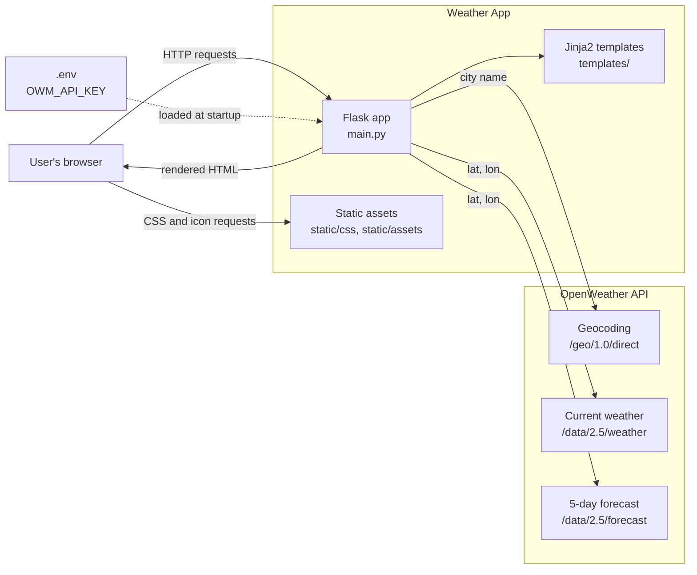
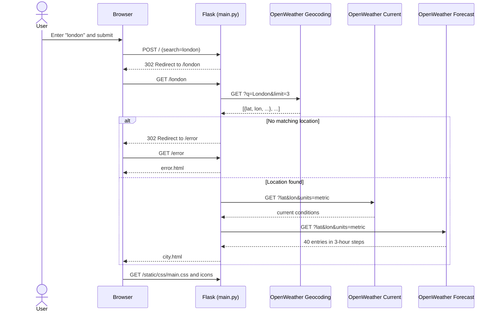
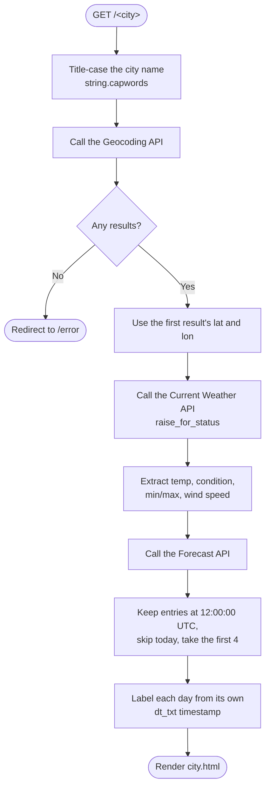
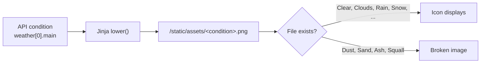

# Architecture

This document describes how the Weather App is structured: its components, how a request flows through them, and the known limitations worth addressing.

## Overview

The Weather App is a small, server-rendered Flask application. It has no database, no client-side JavaScript, and no build step. Every page is rendered on the server with Jinja2, using data fetched live from the [OpenWeather API](https://openweathermap.org/api).

| Layer | Technology | Role |
|---|---|---|
| Web framework | Flask 3.1 | Routing, request handling, redirects |
| Templating | Jinja2 (bundled with Flask) | Server-side HTML rendering |
| HTTP client | requests | Calls to the OpenWeather endpoints |
| Configuration | python-dotenv | Loads `OWM_API_KEY` from `.env` |
| Production server | gunicorn | WSGI server, started by the `Procfile` |
| Styling | Hand-written CSS | Grid, flexbox, and media queries for responsive layout |
| External data | OpenWeather free-tier APIs | Geocoding, current weather, 5-day forecast |

## System context



## Project layout

```
weather-app/
├── main.py              # All application code: config, routes, API calls
├── templates/
│   ├── index.html       # Home page with the city search form
│   ├── city.html        # Current conditions and 4-day forecast
│   └── error.html       # Shown when a city can't be geocoded
├── static/
│   ├── css/main.css     # All styles, including responsive breakpoints
│   └── assets/          # Background images and weather-condition icons
├── requirements.txt     # Flask, requests, python-dotenv, gunicorn
├── Procfile             # web: gunicorn main:app
└── .env                 # OWM_API_KEY (not committed)
```

## Routes

| Route | Methods | Handler | Behavior |
|---|---|---|---|
| `/` | GET, POST | `home()` | GET renders the search form. POST reads the `search` field and redirects to `/<city>`. |
| `/<city>` | GET, POST | `get_weather(city)` | Fetches weather data and renders `city.html`, or redirects to `/error`. |
| `/error` | GET | `error()` | Renders `error.html`. |

Flask matches static routes like `/error` before variable routes like `/<city>`, so `/error` is never interpreted as a city name.

## Request flow

The home form uses the **POST-Redirect-GET** pattern: the form posts to `/`, which redirects to `/<city>`. Each city page therefore has its own bookmarkable URL, and refreshing it does not resubmit the form.



The three API calls run **sequentially and synchronously** on every page view. Nothing is cached.

## Inside `get_weather()`

All of the app's logic lives in one route function. It resolves the city, fetches data, reshapes it, and renders the template.



### Forecast selection

The forecast endpoint returns 40 entries at 3-hour intervals over 5 days. The app keeps the entry stamped `12:00:00` for each of the next four days and derives each day's label from that entry's own timestamp. Deriving labels from the data (not by counting forward from today) keeps labels and temperatures aligned even when today's noon entry has already passed.

Timestamps are in **UTC**, so "noon" is 12:00 UTC, not local noon in the searched city.

## Presentation layer

### Templates

Each of the three templates is a standalone HTML document; there is no shared base template. `city.html` receives these variables:

| Variable | Source |
|---|---|
| `city_name`, `current_date`, `today_label` | Computed in `get_weather()` |
| `current_temp`, `current_weather`, `min_temp`, `max_temp`, `wind_speed` | Current Weather API |
| `forecast` | List of `{day, temp, weather}` dicts from the Forecast API |

### Weather icons

Icons are chosen by **naming convention**: the template lowercases the API's condition name and uses it as a filename.



This needs no lookup table, but any condition without a matching PNG renders as a broken image.

### Responsive layout

`static/css/main.css` uses CSS grid and flexbox, with media-query breakpoints at 450px, 550px, 800px, and 1000px.

## Configuration and deployment

| Setting | Where | Notes |
|---|---|---|
| `OWM_API_KEY` | `.env` or the environment | Required. Loaded by `load_dotenv()` at import time. |
| Units | Hard-coded in `main.py` | `units=metric`; the template hard-codes `ºC`. |
| Dev server | `python main.py` | Flask debug server on port 5000 |
| Production | `gunicorn main:app` | Defined in `Procfile` |

## Known limitations

These are good starting points for the exercises in [EXERCISE.md](EXERCISE.md).

| Area | Limitation | Possible improvement |
|---|---|---|
| Error handling | Only the current-weather call checks the HTTP status. There are no request timeouts. A bad API key or network failure surfaces as a `KeyError` or an unhandled exception. | Call `raise_for_status()` on every request, set timeouts, and show a friendly error page. |
| Security | The geocoding endpoint uses `http://`, so the API key is sent unencrypted. | Switch to `https://`. |
| Testability | Three API calls inside one route function make tests mock `requests.get` three times, in order. | Extract an OpenWeather client function or module. |
| Performance | Three blocking API calls per page view, no caching. | Cache results briefly per city. |
| Icons | Conditions without a PNG show a broken image. | Map conditions with a `dict.get()` fallback. |
| Templates | `<head>` markup and navigation are duplicated in all three templates. | Add a `base.html` and use ``. |
| Consistency | The stylesheet uses `url_for('static', ...)`, but icon paths are hard-coded. | Use `url_for` for all static assets. |
| Routing | `/<city>` accepts POST, but nothing posts to it. | Restrict it to GET. |
| Tests | There is no test suite. | See Task 2 in [EXERCISE.md](EXERCISE.md). |
